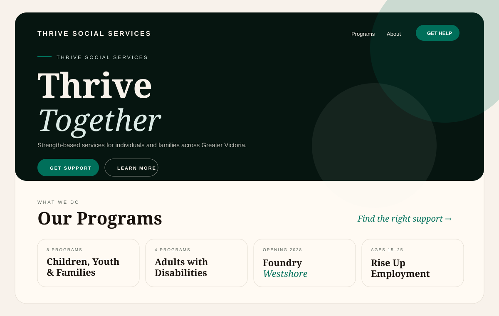
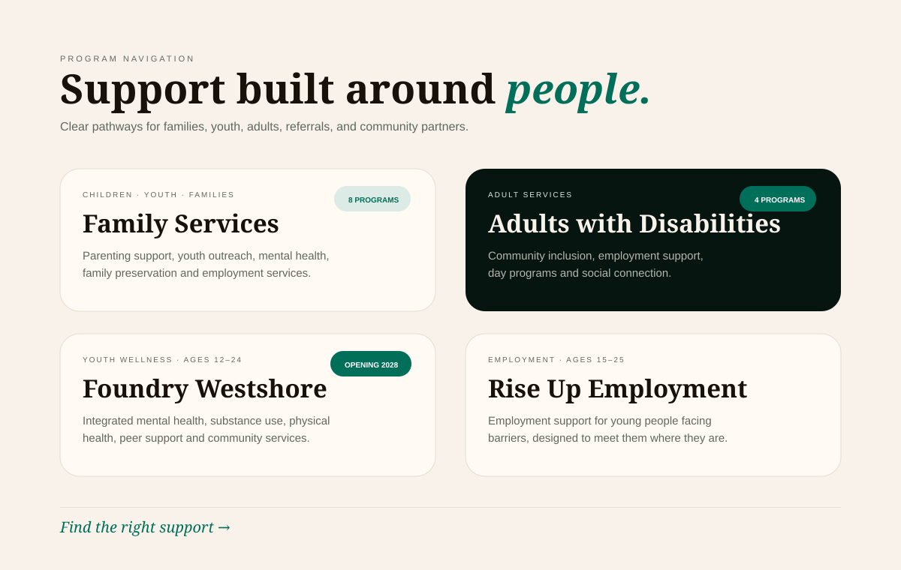
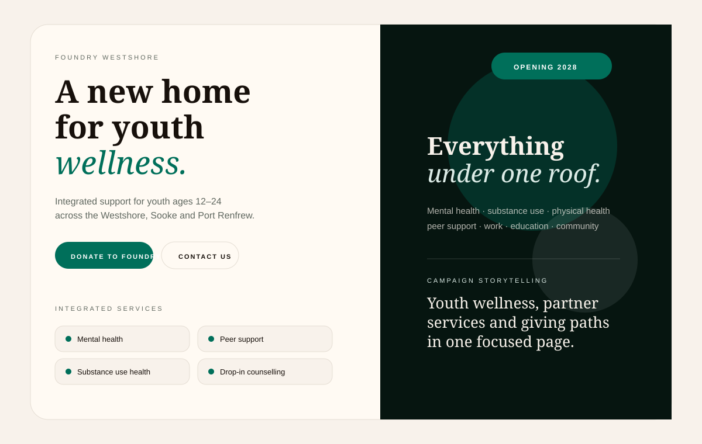
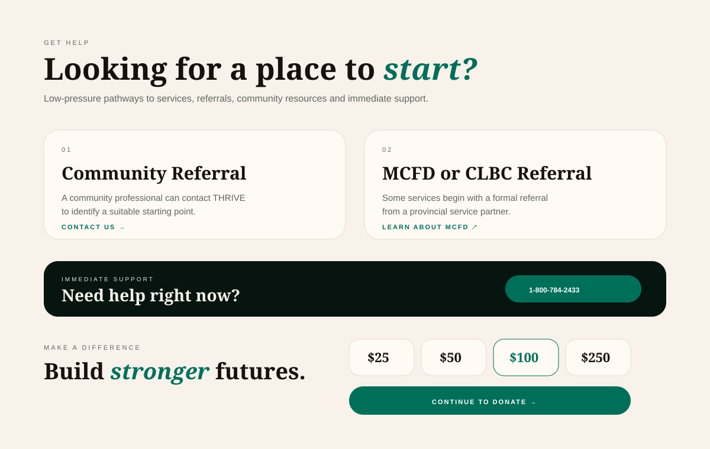

# THRIVE Website Redesign

**A responsive social-services website concept focused on clear support pathways, approachable content architecture, campaign storytelling, and accessible community navigation.**

THRIVE is an independent portfolio redesign concept for **THRIVE Social Services Society**. The project explores how a community-services organization can make complex program information easier to understand while serving two very different user needs: people looking for support and people looking to donate, advocate, or learn more.

**[View the live demo](https://kyla-zeit.github.io/thrive/)**

> **Portfolio concept:** This repository is not affiliated with, endorsed by, or maintained by THRIVE Social Services Society. It is a front-end redesign prototype created for portfolio demonstration. External service and donation links remain with their respective organizations.

## Product preview

<p align="center">
  
  &nbsp;
  
</p>

<p align="center">
  <strong>Homepage</strong> — mission-led storytelling, program discovery, impact, and clear support/donor calls to action.<br/>
  <strong>Program pathways</strong> — structured navigation for families, youth, adults, employment support, and Foundry Westshore.
</p>

<p align="center">
  
  &nbsp;
  
</p>

<p align="center">
  <strong>Foundry Westshore</strong> — campaign storytelling, integrated youth services, donation prompts, and partner-focused messaging.<br/>
  <strong>Get Help / Donate</strong> — low-pressure service access paths paired with a focused giving handoff.
</p>

> The portfolio previews above are source-faithful visualizations based directly on the current React routes, labels, content structure, and cream / ink / green design system. The live GitHub Pages build is the authoritative interactive demo.

## Project at a glance

| Area | Implementation |
| --- | --- |
| Frontend | React 19 + TypeScript |
| Build tooling | Vite 7 |
| Routing | TanStack Router with file-based routes |
| Styling | Tailwind CSS 4 + custom design tokens |
| Motion | Framer Motion |
| UI primitives | Radix UI / shadcn-style components |
| Icons | Lucide React |
| Deployment | GitHub Pages via GitHub Actions |
| Primary experience | Responsive multi-page nonprofit / social-services website concept |

## The design problem

Social-services websites often have to serve visitors arriving with very different levels of urgency, context, and familiarity with available programs.

This redesign separates those needs into clearer pathways:

```text
Visitor
  │
  ├── Needs Support
  │      ↓
  │   Get Help
  │      ↓
  │   Community Referral / MCFD / CLBC
  │      ↓
  │   Family, Youth or Adult Services
  │
  └── Wants to Support THRIVE
         ↓
      Mission / Impact / Foundry
         ↓
      Donate / Get Involved
```

The result is a site structure that puts **service access, reassurance, and clear next steps** ahead of organizational complexity.

## Core experience

### Mission-led homepage

The homepage combines a large editorial hero with direct calls to action for **Get Support** and **Learn More**.

It then moves through:

- Mission and organizational purpose
- Children, youth, family, and adult service pathways
- Foundry Westshore campaign visibility
- Rise Up Employment
- Impact statistics
- Values and community storytelling
- Donation and involvement calls to action

The hero uses scroll-linked motion and staged entrance animation while keeping the actual navigation choices simple.

### Program discovery

Program information is separated by audience instead of presented as one large service directory.

Current routed service areas include:

- Children, Youth & Families
- Adults with Disabilities
- Foundry Westshore
- Rise Up Employment context
- Referral and support pathways

Cards, page hierarchy, route-level metadata, and repeated visual patterns help users move between overview and detail views without relearning the interface.

### Get Help pathway

The `/get-help` experience is intentionally direct and low-pressure.

It distinguishes between:

- Community referrals
- MCFD or CLBC referrals
- External community resources
- Immediate crisis-support information

The page also links users outward to relevant support organizations when THRIVE may not be the right service provider.

### Foundry Westshore campaign

The Foundry route acts as a focused campaign landing page rather than another generic program page.

It includes:

- Youth-focused headline and campaign messaging
- Opening-2028 positioning
- Land acknowledgement
- Integrated-services overview
- Mental health, substance-use, physical-health, peer-support, work, education, and community-service context
- Donation and contact actions
- Closing campaign CTA

This demonstrates how the broader site design system can support a distinct fundraising initiative without feeling disconnected from the parent organization.

### Donation handoff

The donation page presents a simple amount-selection experience with preset amounts before handing the user to the external CanadaHelps donation flow.

```text
Choose Amount
     ↓
Donation CTA
     ↓
External CanadaHelps Flow
```

No payment information is collected or processed by this prototype.

## Information architecture

The current application includes dedicated routes for:

| Route | Purpose |
| --- | --- |
| `/` | Homepage, mission, programs, impact, calls to action |
| `/about` | Organization story, values, and context |
| `/family-services` | Children, youth, and family services |
| `/adult-services` | Adult services and community inclusion |
| `/foundry` | Foundry Westshore campaign page |
| `/get-help` | Referral pathways and community resources |
| `/donate` | Donation amount selection and external handoff |
| `/contact` | Contact and involvement pathway |

TanStack Router provides the file-based route structure, while each major page defines its own metadata for titles and descriptions.

## Design system

The redesign uses a softer editorial visual language intended to feel calm, capable, and human rather than institutional.

### Colour

- Warm cream page background
- Deep ink for high-contrast editorial sections
- Dark green as the primary action colour
- Pale green supporting surfaces
- Soft neutral borders and card backgrounds

### Typography

The theme uses a serif display stack for major storytelling moments and a clean sans-serif body stack for service information. Small uppercase mono-style labels create hierarchy without adding visual noise.

### Interaction

- Rounded cards and pill-shaped calls to action
- Scroll reveal and staggered content motion
- Subtle card lift / highlight interactions
- Responsive type scaling
- Large touch targets
- Persistent, predictable route structure
- Smooth scrolling and reduced visual density around critical support actions

## Responsive approach

The site is designed mobile-first and expands into broader editorial layouts on larger screens.

Responsive behavior includes:

- Stacked mobile service cards
- Multi-column program and impact grids on desktop
- Flexible hero typography
- Wrapping CTA groups
- Adaptive Foundry layout
- Navigation patterns sized for touch interaction

## Architecture

```text
┌───────────────────────────────────────────────┐
│ React + TypeScript                            │
│ Routes · Components · Content · Motion        │
└──────────────────────┬────────────────────────┘
                       │
                       ▼
┌───────────────────────────────────────────────┐
│ TanStack Router                               │
│ File-based pages + route metadata             │
└──────────────────────┬────────────────────────┘
                       │
                       ▼
┌───────────────────────────────────────────────┐
│ Tailwind CSS + Custom Theme                   │
│ Responsive layout · tokens · interaction      │
└──────────────────────┬────────────────────────┘
                       │
                       ▼
┌───────────────────────────────────────────────┐
│ Vite Production Build                        │
│ GitHub Actions → GitHub Pages                 │
└───────────────────────────────────────────────┘
```

## Tech stack

- React 19
- TypeScript
- Vite 7
- TanStack Router
- TanStack React Query
- Tailwind CSS 4
- Framer Motion
- Radix UI primitives
- Lucide React
- React Hook Form / Zod dependencies for extensible form work
- ESLint
- Prettier
- GitHub Actions
- GitHub Pages

## Run locally

### Install dependencies

```bash
npm ci
```

### Start development mode

```bash
npm run dev
```

### Production build

```bash
npm run build
```

### Preview the production build

```bash
npm run preview
```

### Lint

```bash
npm run lint
```

## Deployment

The project deploys automatically to GitHub Pages from `main` using GitHub Actions.

The workflow:

```text
Push to main
    ↓
npm ci
    ↓
npm run build
    ↓
Upload ./dist
    ↓
Deploy to GitHub Pages
```

**Live demo:** https://kyla-zeit.github.io/thrive/

## Project structure

```text
thrive/
├── .github/
│   └── workflows/
│       └── deploy.yml
├── docs/
│   └── assets/              # README portfolio previews
├── src/
│   ├── assets/              # Site photography and brand assets
│   ├── components/          # Shared layout, reveal, and UI components
│   ├── hooks/               # Responsive/client hooks
│   ├── lib/                 # Shared utilities
│   ├── routes/              # File-based application routes
│   ├── routeTree.gen.ts     # Generated TanStack route tree
│   ├── router.tsx
│   ├── main.tsx
│   └── styles.css           # Theme tokens and interaction system
├── package.json
├── vite.config.ts
└── README.md
```

## Scope

THRIVE is a **front-end redesign concept**, not a production service platform. Content, service descriptions, campaign references, and outbound links are used to demonstrate information architecture and interaction design.

A production implementation would require organizational review, content governance, accessibility validation, analytics, a staff-managed CMS, secure production forms, donation-provider integration, and any required service-platform integrations.
